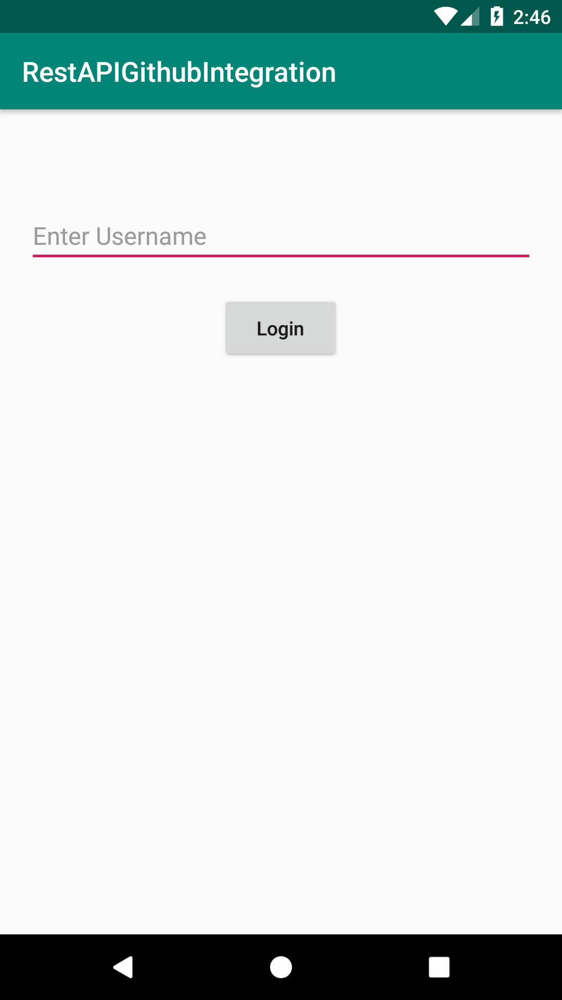
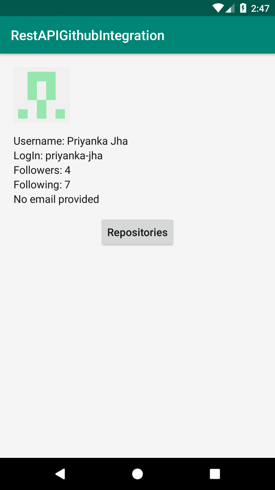
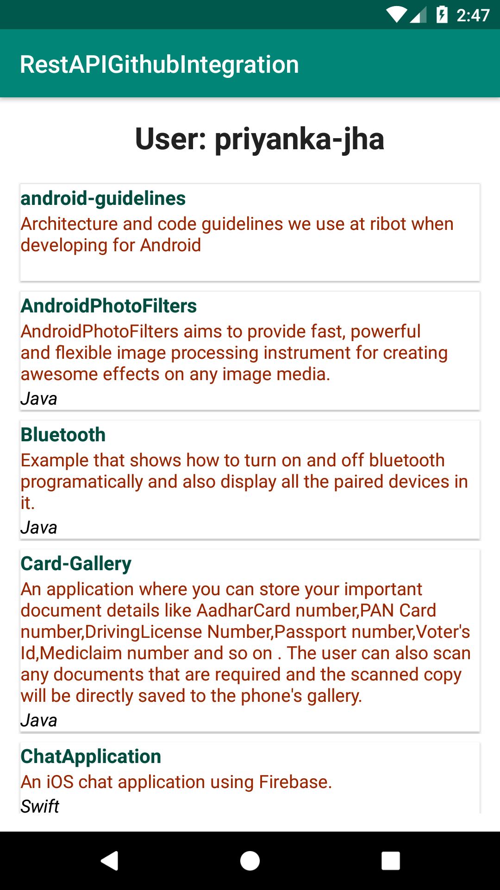

# GithubIntegration-Android
An application showing the Github Integration using Rest API and Retrofit networking ibrary.

**Third party libraries used:**
   
   * [Retrofit](https://square.github.io/retrofit/)
   * [Butterknife](https://github.com/JakeWharton/butterknife)
   
**Third party API used:**
  
   * [GitHub API](https://developer.github.com/v3/)

**Here are the screenshots:**

